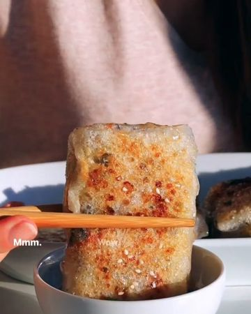

# These crispy Rice Paper Dumplings have become my new obsession! by @cookingwithayeh 

> recipe by [@veganfeedgram](https://www.instagram.com/veganfeedgram/) 
(Vegan Recipes, Healthy Recipes) - [see original post](https://instagram.com/p/CUuE8uCJ2EG)

  
They’re are a combination of two of my favourite things combined… Dumplings & Rice Paper rolls!  
  
They’re crispy on the outside, soft & chewy inside 😋😋  
  
This recipe for Rice Paper Dumplings is also vegan and gluten free so everyone can enjoy them!  
You can also switch you the filling to your fav veggies & protein too!  
  
They’re so good I can’t wait for you all to try them & let me know what you think!   
  
The full recipe with a list of tips is now on her website lovelies, link in her Bio @cookingwithayeh will take you there xxx  
  
https://cookingwithayeh.com/rice-paper-dumplings/  
  
Recipe is inspired by the lovely Lisa from @okonomikitchen ❤️❤️❤️ I saw her video on these on Tiktok & knew I had to try them myself with my own twist 🥰   