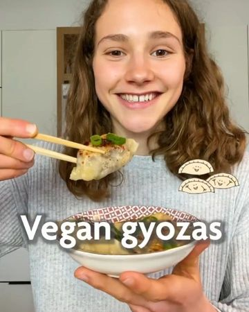

# EAT or PASS on these VEGAN GYOZAS? 🥟😍 by @fitgreenmind Can’t stop, won’t stop...😜 

> recipe by [@veganfeedgram](https://www.instagram.com/veganfeedgram/) 
(Vegan Recipes, Healthy Recipes) - [see original post](https://instagram.com/p/CU9TvzxJUiq)

I gotta say, this was my first time making gyozas myself and they’re BEYOND DELICIOUS! 🤤
And I’m not exaggerating when saying “this might turn you vegan” cause it’s a proven fact! 🤪

💡HACKS
You can find a great tutorial about how to shape the gyozas on @thefoodietakesfloght blog.

RECIPE (25 gyozas each 66cal/3P/8C/1F):
-2 1/4 cup (310g) flour
-3/4 cup + 1 Tbsp (195ml) water
-a pinch of salt
Filling:
-3 scallions
-2 carrots
-2 cloves garlic 
-a thumb ginger
-1 block (200g) tofu (smoked or firm)
Sauce:
-3 Tbsp soy sauce
-1 Tbsp each vinegar abs maple syrup
-1/2 Tsp each Chili flakes and Chinese five spice
KNEAD the dough and let it REST for 20-30min/FRY the filling ingredients, then add the sauce/MAKE 25 wonton wrappers and fill them with 1 TBSP filling/FRY the gyoza on both sides golden brown, then add about 1/2 cup (125ml) water/LET them steam 5-6min 