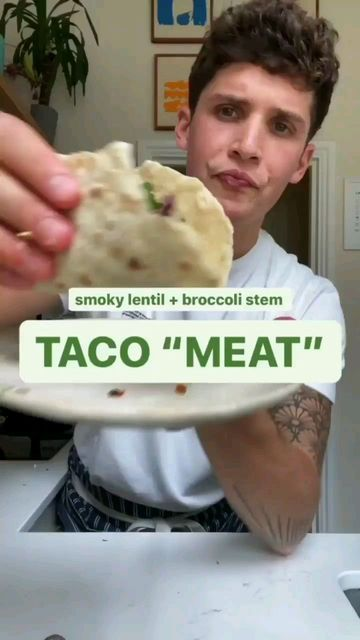

# 🌮TACO “MEAT” 

> recipe by [@veganfeedgram](https://www.instagram.com/veganfeedgram/) 
(Vegan Recipes, Healthy Recipes) - [see original post](https://instagram.com/p/CWVyIYElKCx)

\
🌮A dusty tin of lentils in the cupboard and an unloved broccoli stem are the perfect combo to have with my potato tortillas and mock the texture of meat. by @maxlamanna\
\
🥔Check out my recent reel POTATO TORTILLAS\
\
400g lentils\
1 large broccoli stem, shredded\
1/2 red onion, sliced thinly\
1-2 sun dried tomatoes, choppes\
2 garlic cloves, chopped\
1 tbsp tomato purée \
1 tsp tamari or soy sauce\
1 tsp smoked paprika \
1 tsp cumin powder\
1 tbsp nutritional yeast\
Pinch of salt and black pepper\
Red cabbage \
Coriander \
Lime juice\
\
👨🏻‍🍳Which recipe do you want to see me cook next? Let me know in the comments below.\
\
\#reels \#reelsinstagram \#reelsvideo \#instagram \#foodreels \#zerowaste \#vegan \#veganrecipe \#tacotuesday \#tacos \#plantbased 