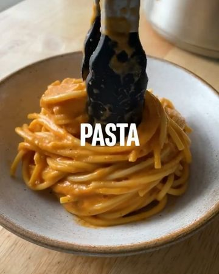

# ROASTED RED PEPPER PASTA 🍝 by @sovegan A classic SO VEGAN recipe. A creamy, tangy and wonderful roasted red pepper sauce with spaghetti ✌️ 

> recipe by [@veganfeedgram](https://www.instagram.com/veganfeedgram/) 
(Vegan Recipes, Healthy Recipes) - [see original post](https://instagram.com/p/CVHxV4hJoPV)

   
Full recipe is below and on their website. Enjoy!  
   
Serves 4  
  
4 red peppers  
1 onion, quartered  
4 garlic cloves  
50g / 1.7oz cashews  
320g / 11.3oz spaghetti  
250ml (1 cup) unsweetened plant-based milk  
1 tbsp dried mixed herbs  
50g / 1.7oz sun-dried tomatoes in oil, drained  
1 tsp balsamic vinegar  
3 tbsp nutritional yeast  
salt and pepper  
   
Top with fresh basil, toasted cashews and red chilli flakes  
   
Preheat the oven to 230°C fan / 400°F.  
   
Transfer the cashews to a bowl and cover in hot water straight from a kettle. Leave to one side to soak.  
   
Add the red peppers to a roasting tray and roast for 15 minutes.  
   
Remove the tray from the oven. Add the quartered onions and garlic cloves and return to the oven for another 15 minutes.  
   
Cook the pasta in boiling salted water as per packet instructions and make sure you reserve some pasta water.  
   
Leave the roasted veggies to cool for 5 minutes. Then peel the onion and garlic, and remove any skin, stalks and seeds from the red peppers. Transfer them to a blender. Drain the cashews and add them to the blender, along with the plant-based milk, 250ml (1 cup) of pasta water you reserved earlier, dried mixed herbs, sun-dried tomatoes (drain as much oil as possible), balsamic vinegar, nutritional yeast, and very generous pinches of salt and pepper. Blend until smooth.  
   
Pour the sauce into a large saucepan on a low-medium heat. Gently heat the sauce, then add the spaghetti.  
   
Top with basil, toasted cashews and chilli flakes. Yum!   