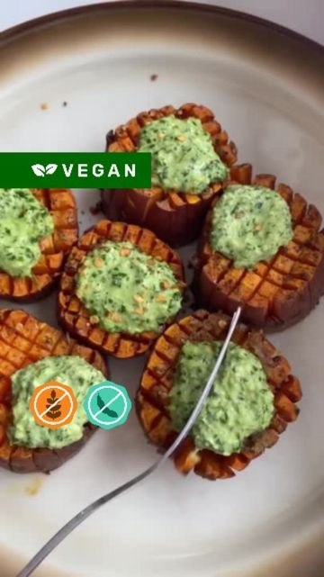

# Sweet Potatoes are the best! Don’t you agree? They’re crispy on the outside yet soft on the inside! Do you wanna try this? 

> recipe by [@veganfeedgram](https://www.instagram.com/veganfeedgram/) 
(Vegan Recipes, Healthy Recipes) - [see original post](https://instagram.com/p/CaQzYdclo7H)


  
Pesto Hasselback Sweet Potato  

  
By @tastysimplyvegan  

  
Recipe:
  
Ingredients:
  
4-5 medium-size sweet potatoes
  
2 tbsp olive oil
  
½ tsp salt
  
½ tsp dried Italian herbs
  
To Serve With
  
Homemade or storebought pesto sauce
  
Chili flakes  

  
Instructions:
  
1. Wash and scrub sweet potatoes very well.
  
2. Slice into 2 cm thick slices.
  
3. Cut each slice in a rack shape but be careful not to cut along through potato.
  
4. Mix olive oil and spices and brush on each slice.
  
5. Bake in the preheated 200C oven for about 45 minutes until golden and crispy on the outside.
  
6. Serve with pesto sauce and chili flakes. Enjoy!  

  
Comment “😍” if you also love sweet potatoes!
  
.
  
.
  
.
  
.
  
\#pesto \#sweetpotato \#purplesweetpotato \#sweetpotatoes \#eatmoreveg \#whoshungry \#veganig
  
\#healthyfoodvideos \#happyvegan \#veganheaven \#vegandish \#snackprep \#easysnacks \#bestfoodever
  
\#foodfuel \#veganchefsofig \#healthyveganrecipes \#guiltfreefood \#plantbasedfood   