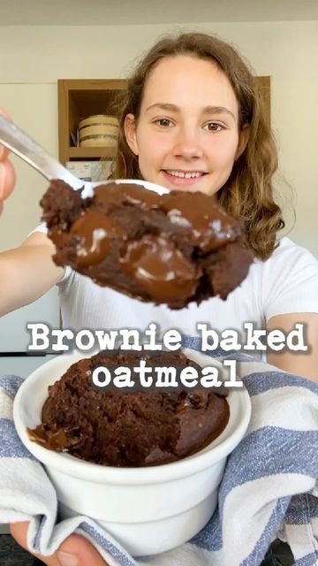

# BROWNIE BAKED OATMEAL 🍫 Aka. an excuse to eat cake for breakfast! 😜 by @fitgreenmind 

> recipe by [@veganfeedgram](https://www.instagram.com/veganfeedgram/) 
(Vegan Recipes, Healthy Recipes) - [see original post](https://instagram.com/p/CVesltTptpK)

\
This baked oatmeal is made with the same ingredients I usually put in my porridge but it really tastes like a brownie...😍\
I guess you have all ingredients for this at home, so definitely try it ASAP! 😇\
\
RECIPE (1 servings with 325cal/16P/37C/9F):\
-2/3 cup (60g) oats\
-1 Tbsp cocoa powder \
-1/2 Tbsp ground flax seeds (optional)\
-2 Tbsp sweetener of your choice \
-2/3 cup (160ml) plant milk\
-1/2 Tsp baking powder\
BLEND all ingredients until smooth/BAKE at 175Celsius/350Fahrenheit for 20-25min 