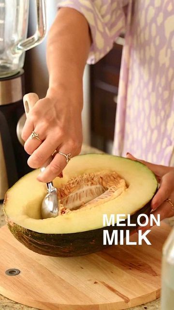

# HONEY MELON MILK 🥛 by @eatmoreplants.no 

> recipe by [@veganfixes](https://www.instagram.com/veganfixes/) 
(Vegan Fixes) - [see original post](https://instagram.com/p/CVuwGCGKGwC)

Don´t throw away your melon seeds! Make the sweetest melon milk instead🤤

Ingredients:
2 cup water
Seeds from half a honey melon

Steps: 
1. Scoop out the seeds from the melon.
2. Add the seeds to a blender along with water. Blend for 2 minutes.
3. Strain using a cloth, and enjoy! 