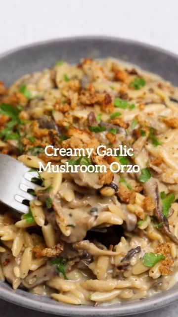

# CREAMY GARLIC MUSHROOM ORZO 🍃 by @sarahsveganrecipes 

> recipe by [@veganfixes](https://www.instagram.com/veganfixes/) 
(Vegan Fixes) - [see original post](https://instagram.com/p/CoJWQKypTeo)

  
Mushrooms are up there as one of my fave ingredients 😍 they’re perfect in this creamy orzo with loads of garlic 🤤 comfort food of dreams!  
  
Recipe serves 2  
4 cloves of garlic  
2 shallots (120g)  
300g mixed mushrooms (I used chestnut, oyster and shiitake)   
180g orzo   
1 litre mushroom (or vegetable) stock   
2 tbsp nutritional yeast   
4 tbsp unsweetened soya yoghurt   
10 sprigs thyme   
  
To serve (optional):  
Crispy garlic breadcrumbs   
Chopped parsley   
  
Finely chop the garlic and shallots. Add to a pan with some olive oil and a pinch of salt. Cook until soft and lightly golden. Add the leaves from the thyme.  
  
Tear or roughly chop the mushrooms and add to the pan. Leave to cook for at least a minute until moving. Turn up the heat slightly and cook the mushrooms until golden.   
  
Add the orzo to the pan, mix well and then pour in the stock and add the nutritional yeast. Leave to simmer for 10-15 minutes or until the orzo is al dente and stock has reduced. Stir through the yoghurt, make sure it’s well combined. Serve up, sprinkle with the parsley and breadcrumbs and enjoy! 💛   