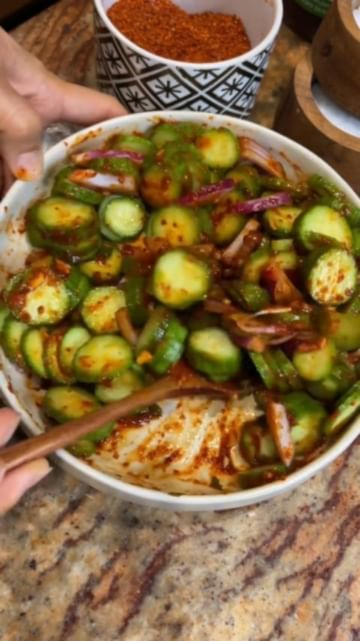

# Korean Cucumber Salad 🥒🌶🔥 by @seonkyounglongest  

> recipe by [@veganfixes](https://www.instagram.com/veganfixes/) 
(Vegan Fixes) - [see original post](https://instagram.com/p/CamdODbJO7u)

  
6 Persian cucumbers or 2 English cucumber, sliced
3 cloves garlic, chopped  
2 green onions, chopped
3 tbsp gochugaru, Korean red pepper flakes
2 tbsp @yondu.usa   
Pinch of salt to taste  
Fresh juice from 1 lemon  
1 1/2 tbsp sugar  
Sesame seeds  
  
.  
.  
.  
.  
.  
.  
.  
.  
.  
.  
.  
\#veganfinds \#veganfoodblogger \#veganfoodlover \#veganfortheplanet \#vegansofinsta \#veganessen \#veganfeature \#vegancomfortfood \#veganstrong \#veganislove \#veganized \#veganism \#vegandiet \#vegantravel \#veganporn   