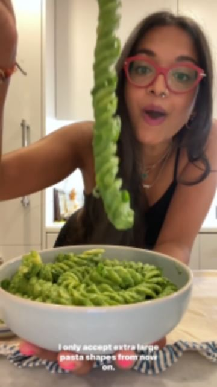

# Change up your average pasta dinner w/ @chefpriyanka’s giant fusilli with spinach jalapeño pesto. 

> recipe by [@veganfixes](https://www.instagram.com/veganfixes/) 
(Vegan Fixes) - [see original post](https://instagram.com/p/CdDGuWxJnZP)

Ingredients: 
- 1 whole bunch baby spinach boiled
- 3 cloves garlic 
- 1 jalapeño chopped
- whites of 1 stalk scallions chopped
- 2 tbsp unsalted almonds 
- salt & pepper 
- 1/4 cup evoo 
- pasta cooked al dente 
- scallion greens for garnish 

Steps: 

1. Place boiled spinach into a blender with all other ingredients. Blend until super smooth. 
2. Add to cooked pasta with 1/2 cup pasta water. Mix & garnish with scallions. 

.
.
.
.
.
.
.
\#veganfoodshare\#makesmewhole \#veganrecipes \#veganbowls \#feedfeed \#letscookvegan \#bestofvegan \#veganvultures\#veganfoodshare \#plantbased \#plantstrong\#wfpb \#thrivemags \#forksoverknives \#veganliving 