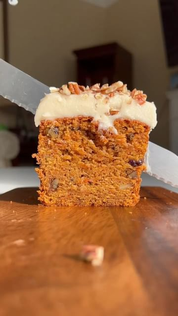

# 🥕 Favourite Carrot Cake with Miso Cream Cheese Frosting (*ฅ́˘ฅ̀*)⁣ by @okonomikitchen  

> recipe by [@veganfixes](https://www.instagram.com/veganfixes/) 
(Vegan Fixes) - [see original post](https://instagram.com/p/CdDgGKiJYgW)

⁣  
My dad used to always come home with the huge thing of carrot cake from Costco around this time of year, so I’ve been craving it a lottttt and finally landed on this recipe ⁣that I thought was (*better*) just as good. ⁣  
⁣  
This carrot loaf cake has a tight, tender moist crumb, yet still fluffy— generously spiced and studded with rum raisins & pecans.⁣  
⁣  
As much as living on my own is nice… I MISS MY FAMILY LOL 😭 and having people around me b/c it does get pretty lonely (esp working from home). I rarely ever get to see my dad and sisters, so I like to leave them some food as a small way to still connect with them. ⁣  
⁣  
How about you?? Do you miss living at home or love the independent adult life? 🙂 ⁣  
⁣  
—-⁣  
⁣  
✨full recipe with on the blog, [https://okonomikitchen.com/carrot-cake-loaf] link in her story! ⁣⁣⁣⁣⁣  
⁣⁣⁣⁣⁣  
 .⁣⁣⁣⁣⁣  
.⁣⁣⁣⁣⁣  
.⁣⁣⁣⁣⁣  
.⁣⁣⁣⁣⁣  
.⁣⁣⁣⁣⁣  
⁣⁣⁣⁣⁣.  
.  
\#veganfinds \#veganfoodblogger \#veganfoodlover \#veganfortheplanet \#vegansofinsta \#veganessen \#veganfeature \#vegancomfortfood \#veganstrong \#veganislove \#veganized \#veganism \#vegandiet \#vegantravel \#veganporn   