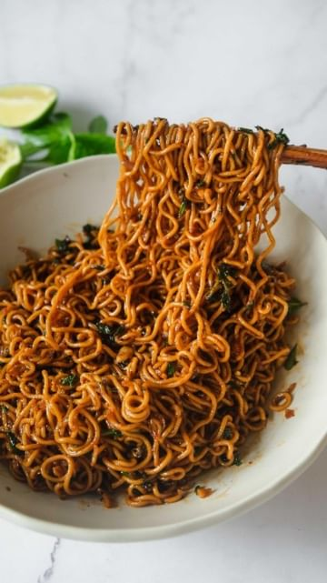

# Basil and Garlic Oil Noodles! 🌿🧄🍜 @thefoodietakesflight 

> recipe by [@veganfixes](https://www.instagram.com/veganfixes/) 
(Vegan Fixes) - [see original post](https://instagram.com/p/CdL1Ic8Du7G)

I’ve been looking for more ways to use up all the basil growing in my plant box right outside my kitchen so I thought I’d make this easy yet very tasty and aromatic bowl of noodles. 🌝

Full recipe’s in my blog www.thefoodietakesflight.com! Direct link is also in my bio @thefoodietakesflight ◡̈ 

I simply cooked the noodles, added all the ingredients in the bowl, heated the oil, and poured it over all the ingredients before adding back in the cooked noodles and mixing everything together.

www.thefoodietakesflight.com/basil-garlic-oil-noodles
.
.
.
.
.
.
\#veganaf \#vegandinner \#veganskincare \#vegana \#veganlunch \#veganrecipe \#veganmeals \#veganlove \#veganathlete \#veganshare \#vegancommunity \#veganeats \#veganbreakfast \#veganuk \#veganismo 