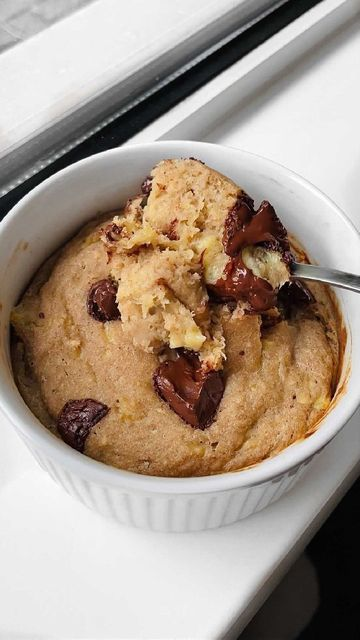

# single serving banana bread 💛 by @liamoves 

> recipe by [@veganfixes](https://www.instagram.com/veganfixes/) 
(Vegan Fixes) - [see original post](https://instagram.com/p/CXOIE6NJOul)

I know you probably have that one lonely overripe banana sitting on your counter and you’re not sure what to do with it so here is the ultimate overripe banana savior - single serving banana bread that’s super easy to make and tastes like the real deal. 

Ingredients:
💛 1 overripe banana (~100g)
💛 5g (1 tsp) peanut butter
💛 20ml (4 tsp) dairy-free milk
💛 sweetener ( @myvegan toffee flavdrops, 1 tbsp brown sugar, coconut sugar, sugar substitute,…)
💛 40g (5 tbsp) flour 
💛 pinch of salt
💛 pinch of cinnamon
💛 1/2 tsp baking powder
💛 optional but not really: chocolate chips 

Bake on 180°C / 350°F for 20 minutes. 

Enjoy!
Tag me if you make this! I’d love to see your remakes! 🥰

.
.
.
.
.
.
.
.
.
.
.
\#veganfinds \#veganfoodblogger \#veganfoodlover \#veganfortheplanet \#vegansofinsta \#veganessen \#veganfeature \#vegancomfortfood \#veganstrong \#veganislove \#veganized \#veganism \#vegandiet \#vegantravel \#veganporn \#veganproblems \#veganiseasy \#veganrevolution \#veganisthefuture \#veganslimmingworld \#veganuk \#vegandiet \#veganfoods \#veganblogger \#veganlife 