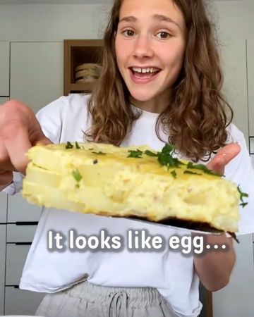

# VEGAN SPANISH TORTILLA 👩‍🍳 It’s EGG-cellent! 😉 by @fitgreenmind 

> recipe by [@veganfixes](https://www.instagram.com/veganfixes/) 
(Vegan Fixes) - [see original post](https://instagram.com/p/CUzhETHJrBV)

\
Spanish tortilla is a spanish omelette made with eggs, potatoes and onion. My mom made it oftentimes when I was a little Maya and FINALLY I made a good vegan version. 🥳\
The silken tofu gives it a very „eggy“ texture, my whole family (even my grandma) loved it…☺️🙏\
\
👩‍🍳 To flip it: place a plate on top of the pan, turn it upside down that the tortilla falls on the plate, let it slide back in the pan.\
Much love\
Maya ✨\
RECIPE (3 servings each 330cal/15P/47C/6F):\
-600g potatoes\
-1 large onion\
-oil for frying\
„Egg“:\
-300g silken tofu\
-1/4 cup (60ml) plant milk\
-1 Tsp each salt, garlic and pepperrrr (you can use kala Namak for a more eggy taste)\
-a pinch of turmeric for colour \
-2 Tbsp corn starch\
-1/3 cup (45g) chickpea flour\
-oil for frying\
BOIL the potatoes 5-7mins/FRY with the onion in a bit oil whilst blend the „egg“/STIR in onion and potato in the mixture/TRANSFER to a pan, cover and let it cook on low heat 10-15mins/FLIP and cook for 2-3mins/LET IT COOL DOWN about 5-7mins (it’ll firm up more) 