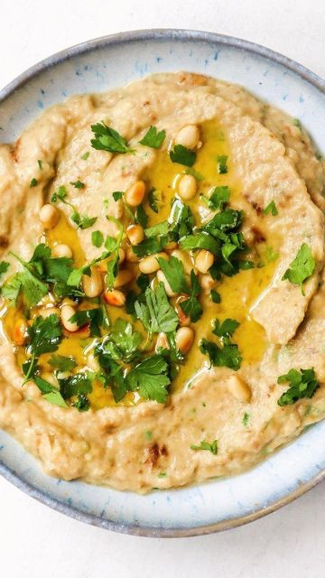

# THE BEST BABA GANOUSH 🍆 by @weareweano  

> recipe by [@veganfixes](https://www.instagram.com/veganfixes/) 
(Vegan Fixes) - [see original post](https://instagram.com/p/CXQ6Q6aJbHT)

\
I love Middle Eastern flavours, and this Baba Ganoush is one of my absolute favourites 🤤 Smooth, smokey and absolutely dreamy! Ready to make some?! 😍 Here’s all you need: \
\
2 aubergines, halved\
2 tbsp tahini\
2 tbsp olive oil\
2 garlic cloves, minced\
Juice of half a lemon\
3 tbsp parsley, chopped\
1/4 tsp salt \
\
To serve:\
1 tbsp roasted pine nuts\
1 tbsp fresh parsley\
Drizzle of olive oil\
\
.\
.\
.\
.\
.\
.\
.\
.\
.\
.\
\#veganfoodshare\#makesmewhole \#veganrecipes \#veganbowls \#feedfeed \#letscookvegan \#bestofvegan \#veganvultures\#veganfoodshare \#plantbased \#plantstrong\#wfpb \#thrivemags \#forksoverknives \#veganliving 