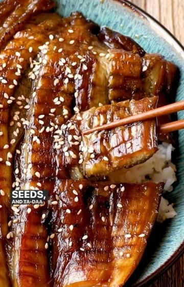

# Vegan Unagi made from eggplant is extra scrumptious! by @woon.heng I used to not appreciate eggplant when I was a kid, but as I grow older, I just can't live without it. Dishes like Yong Tau Foo (stuffed tofu but can be made with a lot of vegetables variety - a delicacy not to be missed when I visit home), Yu Xiang Qie Zi, Nasu Dengaku, Di San Xian, or serve as cold appetizers like banchan or with vinegary sauce - ooh so versatile, isn't it?⁣ 

> recipe by [@veganfixes](https://www.instagram.com/veganfixes/) 
(Vegan Fixes) - [see original post](https://instagram.com/p/ChEfh38p885)

⁣
Full recipe instructions - link in bio ⁣@woon.heng
or https://woonheng.com/vegan-unagi-eggplant/⁣
or search vegan unagi eggplant on woonheng.com⁣
⁣
Cooking notes:⁣
- If you don't have a steamer, don't worry, you can wrap in a foil, then bake until tender or check out my other ways to cook the eggplant on my blog⁣
- The sauce is the same one that I used for my vegan salmon bowl but you can also use the vegan unagi made from tofu and potato sauce⁣
- If you are not a fan of eggplant and miss the unagi, google 'woonheng vegan unagi eel'⁣
- and if you are an eggplant fan and love to buy them in bulk when they are on sale, try this recipe. I usually prep them ahead of time, steam, then cut open and store them in a container. When ready, I will then sear and baste it with sauce. ⁣
⁣
Other eggplant recipes to try from my blog⁣
- Yu Xiang Qie Zi (Spicy Garlic Eggplant)⁣
- Easy Dou Ban Jiang (Fermented bean sauce) Eggplant⁣
- Stuffed Eggplant with vegan pork⁣
- Air-fried eggplant with tomato⁣
⁣

.⁣
.⁣
.⁣
.⁣
.⁣
\#veganfinds \#veganfoodblogger \#veganfoodlover \#veganfortheplanet \#vegansofinsta \#veganessen \#veganfeature \#vegancomfortfood \#veganstrong \#veganislove \#veganized \#veganism \#vegandiet \#vegantravel \#veganporn 