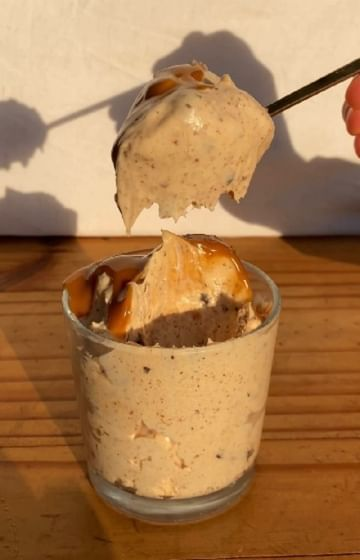

# vegan SALTED CARAMEL ICE CREAM🧡 // full recipe ↓  

> recipe by [@veganfixes](https://www.instagram.com/veganfixes/) 
(Vegan Fixes) - [see original post](https://instagram.com/p/ChFCz4npAT6)

\
This is the best vegan ice cream you’ll ever have! It’s super easy to make and so delicious🤩 \
\
INGREDIENTS:\
For the ice cream:\
- 350 g vegan whipping cream\
- 2/3 cup almond butter (recipe on feed!)\
- 1/4 cup dates syrup\
- 3/4 tsp salt\
- 300 g coconut condensed milk \
- 100 g dark chocolate\
\
For the caramel sauce:\
- 1/3 cup almond butter / peanut butter\
- 1/3 cup dates syrup / maple syrup\
- 3 tbsp coconut oil\
\
INSTRUCTIONS:\
- Make the ice cream:\
Whip the vegan whipped cream until it reaches stiff peaks. In a different bowl, mix the coconut condensed milk, almond butter, dates syrup and salt until smooth. Add 1/3 of the whipped cream to the condensed milk mixture and fold using a spatula. Pour the condensed milk mixture into the whipped cream and fold again to combine. Add the chopped dark chocolate and fold it in. Pour into a container and freeze overnight or for several hours until solid. \
\
- Make the caramel sauce:\
In a bowl, mix all the ingredients until smooth and shiny.\
\
ENJOY🧡\
.\
.\
.\
.\
.\
.\
.\
.\
.\
.\
.\
\#icecreamrecipe \#veganicecream \#saltedcaramelicecream \#icecreamporn \#dessertrecipe \#vegandesserts \#vegandessertrecipes \#vegandessert \#veganrecipeshare \#dessertideas \#icecreamrecipe \#veganrecipes \#summerdessert \#vegancaramel \#saltedcaramel 