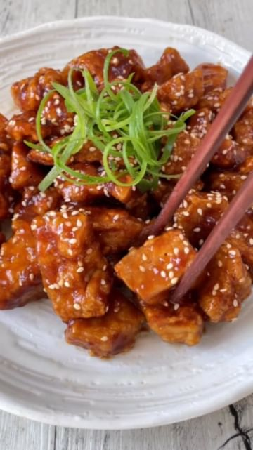

# Sticky Sesame Garlic Tofu 😍 by @thrivingonplants It’s crispy on the outside, firm yet pillowy on the inside and coated in the most delicious sticky garlicky sauce! Plus, while I always love a good deep-fried recipe, this one was actually made in the oven👌🏼 SAVE THIS POST because you’re going to want to try it asap!!  

> recipe by [@veganfixes](https://www.instagram.com/veganfixes/) 
(Vegan Fixes) - [see original post](https://instagram.com/p/Cl_PiILpwGe)

\
Ingredients: \
1 block firm tofu (400g)\
1/4 cup cornstarch/cornflour\
1/4 tsp sea salt \
1/4 tsp ground white pepper\
\
Sauce: \
4-5 cloves garlic, grated or minced \
1/4 cup soy sauce\
2 tbsp tomato sauce/ketchup\
2 packed tbsp brown sugar\
1 tbsp rice vinegar \
1/4 cup water\
2 tsp cornstarch/cornflour\
2 tsp sesame oil \
\
Garnish:\
Toasted sesame seeds\
Green onion\
\
Method: \
1. Preheat the oven to 200°C. Open your packet of tofu and drain out the excess liquid. Using clean hands, break chunks off the tofu to create bite sized pieces. Add into a bowl along with the cornstarch, salt and pepper and toss well to coat. \
2. Spread the tofu out onto a lined baking tray, ensuring each piece does not touch or overlap. Spray generously with any neutral oil and bake for 20 minutes or until golden and crispy. Alternately you can also air-fry in batches! \
3. In the meantime, fry the garlic in a splash of oil over medium heat. Add in the soy, tomato sauce, sugar and vinegar. Stir well and cook for 1 minute.\
4. Mix the water and cornstarch together then pour it into the pan. Allow mixture to bubble, stirring frequently until thickened. Turn off the heat and stir through the sesame oil. \
5. Add in the baked tofu and stir well to coat in the sauce. \
6. Transfer onto a plate and garnish with sesame seeds and green onions. Enjoy immediately! \
\
*Note: I would not recommend this as a dish to eat later/reheat. You definitely can, but you will lose the crispy coating on the outside. If you’re making this ahead of time just keep this in mind. In short, still delicious but you’ll lose the texture! 