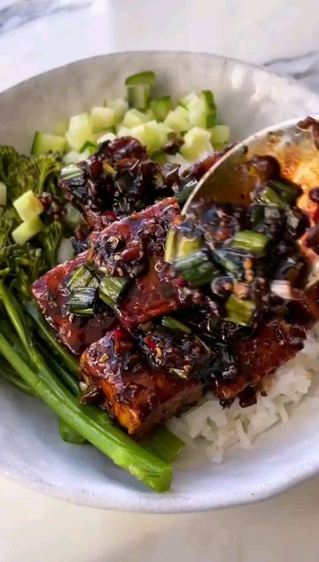

# BLACK PEPPER TOFU🔥 by @sovegan This is our take on a classic Chinese dish - which we make using super crispy tofu. The black pepper is the star of the show and it gives our sauce a seriously FIERY flavour ✌️ 

> recipe by [@veganfixes](https://www.instagram.com/veganfixes/) 
(Vegan Fixes) - [see original post](https://instagram.com/p/CZ3si2apqyJ)

 
Serves 2
 
🌿 300g (10.6oz) firm tofu, press if required
🌿 3 tbsp coconut oil
🌿 1.5 tbsp cornflour
🌿 jasmine rice, for 2 people
🌿 150g (5.3 oz) broccoli
🌿 3 garlic cloves, peeled + finely chopped
🌿 1/2 thumb of fresh ginger, peeled + finely chopped
🌿 2 tbsp light soy sauce
🌿 1 tbsp dark soy sauce
🌿 3 tbsp maple syrup
🌿 3 tsp black peppercorns
🌿 3 spring onion, chopped
🌿 1/2 red chilli, chopped + seeds removed
🌿 1/4 cucumber, diced
 
1️⃣ Slice the tofu into cubes and transfer to a bowl. Cover with the cornflour and mix until the tofu is coated all over in the cornflour.
 
2️⃣ Add 1 tablespoon of coconut oil to a non-stick frying pan on a medium heat. When the oil is hot, add the tofu and fry on all sides until golden, which will take about 10-15 minutes. Then transfer to a plate.
 
3️⃣ Meanwhile, cook the rice as per the packet instructions and steam the broccoli for about 5 minutes or until slightly soft, then keep both covered.
 
4️⃣ Place the pan back on the heat and add 2 tablespoons of coconut oil. When the oil is hot, add the garlic and ginger and fry for 2 minutes or until they begin to brown.
 
5️⃣ Next add the light soy sauce, dark soy sauce and maple syrup. Then grind the peppercorns and add them to the sauce (depending on how fiery you like it, you might want to add half and see how you go). Turn the heat up and cook for another couple of minutes or until the sauce begins to thicken, but avoid caramelising the sauce because the syrup might burn.
 
6️⃣ Finally add the crispy tofu, spring onion, and red chilli. Stir to coat the tofu in the sauce, then serve with the jasmine rice, broccoli and cucumber.

.
.
.
.
.
.
.
.
.
.
\#veganmeal \#veganmealplan  \#plantbased \#vegan \#veganrecipes \#vegansofig \#veganpower \#whatveganseat \#veganmealprep \#plantbasedfood \#veganlunch \#vegandinner \#veganfood \#veganrecipe \#plantbaseddiet 