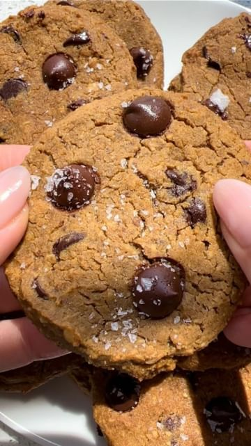

# Bookmark CHICKPEA CHOCOLATE CHIP COOKIES 🍪✨follow @healthygirlkitchen for more vegan recipes!  

> recipe by [@veganfixes](https://www.instagram.com/veganfixes/) 
(Vegan Fixes) - [see original post](https://instagram.com/p/CdgrHxZhn79)

Ingredients: 
1 15 oz can of chickpeas rinsed and drained
5 pitted dates
1/2 cup creamy peanut butter
1/4 cup rolled oats
1/4 cup coconut sugar
1/4 maple syrup
1/2 cup vegan chocolate chips plus extra for topping
1 tsp vanilla
1/2 tsp baking powder
1/2 tsp baking soda
sea salt garnish

instructions: 
1. Preheat oven to 350 degrees F and prep and baking sheet with parchment paper.
2. Blend all ingredients in a food processor except chocolate chips, baking powder and baking powder. 
3. Blend until smooth scraping down the sides as necessary.
4. Blend in the baking soda and baking powder. Pour in the chocolate chips and stir with a spoon until combined.
Make the cookies about 2 tbsp of cookie dough. Use a spoon because it's sticky to touch. Flatten a bit. Add extra chocolate chips on top. This yields about 14 cookies.
5. Bake for 13-15minutes. They will be soft but they'll firm up.
6. Enjoy besties! 

\#veganuniverse \#veganfoodie \#veganlove \#veganshare \#veganinspiration \#veganpower \#veganbowl \#vegansoulfood \#vegansuk \#veganpizza \#veganmom \#veganfoodlovers \#veganfoodblog \#veganaf \#vegancooking 