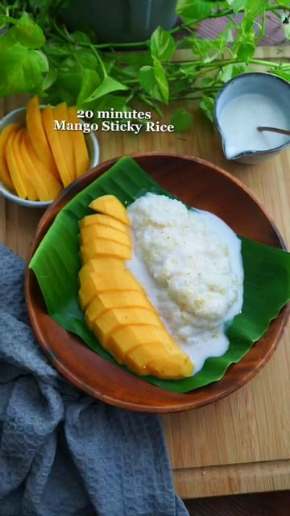

# Mango Sticky Rice by @foodpassionical This recipe does not require to soak the glutinous rice, it just need to cook on a gas stove or rice cooker. This recipe only need 20 minutes to make it! Trust me, you can make with hassle free at home and it’s much easier than you think!  

> recipe by [@veganfixes](https://www.instagram.com/veganfixes/) 
(Vegan Fixes) - [see original post](https://instagram.com/p/CjtMJIzhc0M)

  
Recipe:   
For cook the rice:   
210g glutinous rice  
100ml coconut cream   
1/2 tsp salt   
600ml water   
  
For the sauce:   
100ml coconut cream   
2 tbsp water   
2-3 tbsp sugar   
1/2 tbsp cornstarch   
Pinch of salt   
  
For serving:  
1 mango  
Toasted sesame seeds   
  
1) Rinse the glutinous rice for few times & drain. Add in water and salt. Cook over medium heat on the gas stove (about 20 minutes) or use rice cooker.   
  
2.) Meanwhile prepare the sauce ingredients. In a small heat proof bowl, mix together all the sauce ingredients. Mix well and microwave it for 40-45 seconds. Remove from the microwave, mix again and set aside.   
  
3) Once the glutinous rice is cooked, add in 100ml of coconut cream. Mix to combine and let it sit for few minutes or wait till the milk absorbed entirely. Meanwhile, slice the mango.   
  
4.) Serve the sticky rice together with the mango and pour the sauce on it. Sprinkle with some sesame seeds and enjoy.   