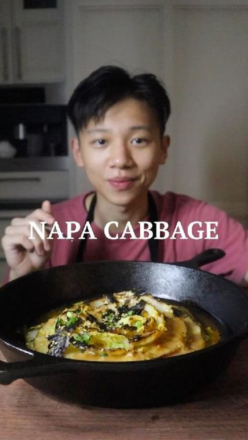

# SEARED NAPA CABBAGE with miso butter #VEGAN. 🥬 by @chez.jorge Suitable decadence for the humble vegetable, I’d say. Searing cabbage like a steak not only gives you incredible charred notes, but the intense heat locks up all those juices, keeping each leaf juicy & crunchy. It’s so good.  

> recipe by [@veganfixes](https://www.instagram.com/veganfixes/) 
(Vegan Fixes) - [see original post](https://instagram.com/p/CY3omBtjCM3)

  
Flavor aside, can we just appreciate how the cabbage looks just like a flower?! Nature is so beautiful. Boys, it’s your calling to use this dish and impress a special someone.😏   
  
THE RECIPE (for 4):  
1 large (700 g) napa cabbage  
vegetable oil, for searing  
4 tablespoons vegan butter  
3 cloves garlic, finely minced  
3 tablespoons light-brown miso  
4 tablespoons mirin (or sake)  
2 teaspoons tamari soy sauce  
1/3 cup water  
1 sheet toasted nori, for topping  
1 tablespoon toasted sesame seeds, for topping  
1 scallion, for topping   
  
🌱 Lots of ways you can change up the flavor using a different sauce! Umami, citrusy, & spicy flavors all go great with seared cabbage.  
  
.  
.  
.  
.  
.  
.  
.  
.  
.  
.  
.  
.  
\#healthyvegan \#veganinspo \#veganlifestyle\#eatwellfeelwell \#foodforfuel \#nourishnotpunish \#veganism \#bestofvegan \#veganfood \#veganstudent \#veganrecipes \#veganbowls \#feedfeed \#letscookvegan \#bestofvegan   