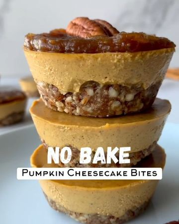

# 🎃🌱🍰 NO BAKE Mini Pumpkin Cheesecakes!!!! by @that.veganbabe 

> recipe by [@veganfixes](https://www.instagram.com/veganfixes/) 
(Vegan Fixes) - [see original post](https://instagram.com/p/CVKYy2mJPC-)

🤤These babies are seriously decadent and delicious and take 10-15 minutes to make! This plant based dessert will satisfy your sweet tooth and leave you feeling full and satisfied! 

✨INGREDIENTS✨

For the Crust
1 cup pecans
1 cup almonds
1/2 tsp salt
3 tbsp maple syrup

Pumpkin Filling
2 cups soaked cashews
1/2 cup coconut cream
1/2 cup pumpkin purée
1/2 cup maple syrup
1/4 cup lemon juice
1 tsp vanilla
1.5 tbsp pumpkin spice

Date Caramel
8 medjool dates
1 tsp vanilla
1/3 cup water 

🥰 Pulse the ingredients for the crust together until a fine meal has formed. Divide into greased muffin tins & pat down with your fingers.

👌Blend the filling ingredients together in the same blender (no need to rinse) then divide equally into the muffin tins on top of the crust.

💜Shake the muffin tin to flatten the cheesecakes then freeze your for at least 5 hours for them the firm up! Take them out 10 minutes before you’d like to eat them!

🌱Blend the ingredients for the date caramel in a small blender and add more water as needed. Add on top of the cheesecakes with a pecan for fanciness! 