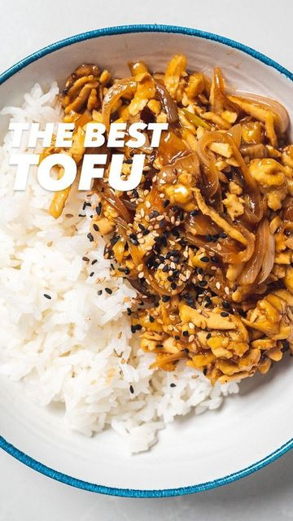

# The Best Tofu 😏 by @addictedtohumus 

> recipe by [@veganfixes](https://www.instagram.com/veganfixes/) 
(Vegan Fixes) - [see original post](https://instagram.com/p/CY5wGdyDTA0)

And, oh wow! It’s such a fun and tasty way to eat tofu. And our sauce is😈\
.\
Ingredients:\
- 200gr tofu, shredded\
- 2 tbsp corn starch\
- some oil to fry\
- 1 onion\
- 6 shiitake mushrooms\
Sauce:\
- 3 tbsp soy sauce\
- 1 tbsp sweetener\
- 1 tbsp balsamic vinegar\
- 100ml water\
- plus: white rice to serve\
.\
1. Shred the tofu and toss it with the corn starch\
2. Bake it, air fry it or fry until crispy\
3. Mix all the ingredients for the sauce\
4. Stir fry the veggies for some minutes and move the tofu back into the pan and the sauce\
5. Serve with some rice and top it up with spring onion and sesame seeds\
.\
.\
.\
.\
.\
.\
.\
\#veganpower \#whatveganseat \#veganmealprep \#plantbasedfood \#veganlunch \#vegandinner \#veganfood \#veganrecipe \#veganfoodie \#veganlunch \#veganfamily \#simplevegan \#plantbasedvegan \#easyveganmeals \#healthyfood 