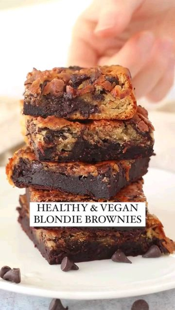

# Easy, Health(ish) Blondie Brownies 😍 (vegan, gluten-free option, refined sugar-free, oil-free) by @kitseats 

> recipe by [@veganfixes](https://www.instagram.com/veganfixes/) 
(Vegan Fixes) - [see original post](https://instagram.com/p/CaPJUY7pnAg)

  
When you can’t choose between a blondie and a brownie - combine the two 😂  
  
You’re gonna wanna SAVE & SHARE ❤️  
  
INGREDIENTS  
- 200g + 100g Coconut Yoghurt @coconutcollab (or greek style, thick yoghurt)  
- 125g Agave @thegroovyfoodcompany (or maple syrup)  
- 100g Peanut Butter  
- 110g Plain Flour (use gluten-free if needed)   
- 2 tsp Baking Powder  
- 1/4 tsp Salt  
- 50g Cocoa Powder @droetkerbakes   
- 50g Dark Choc Chips   
  
METHOD:  
1. Combine 200g yoghurt with the agave and peanut butter, mix until smooth.  
2. Sift the flour, baking powder and salt. Add in the wet mixture and fold until combined.  
3. Set aside a third of the mixture.  
4. Add cocoa powder and 100g yoghurt to the 2/3 mixture. Add a splash of milk if needed. (See video for consistency)  
5. To the other third, add in the choc chips.  
6. Spoon in the two batters into a baking tin (8x8 inch) and spread out to make a marble effect.  
7. Bake for 30 mins @ 180°C.  
8. Once cooled, remove from the tin and slice!  
  
Who’s making them? 😍  
.  
.  
.  
Follow @kitseats for more delicious recipes.  
  
.  
.  
.  
.  
.  
.  
.  
.  
\#veganrecipes \#veganfood \#plantbasedfoodie \#vegancomfortfood \#plantbasednutrition \#veganfoodporn \#veganfoodie \#veganfoodshare \#plantbasedfoods \#veganfoodlovers \#plantbase \#plantbasedvegan \#vegetarianfood \#plantbasedmeals \#plantbasedmeal   