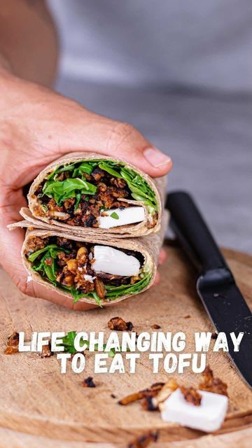

# Life changing way to eat tofu!😍 by @giansnutrition 

> recipe by [@veganfixes](https://www.instagram.com/veganfixes/) 
(Vegan Fixes) - [see original post](https://instagram.com/p/CWldhdXDhV_)

Please give this recipe a try🥰  
This is the best wrap we ate so far 😍  
What’s your favorite way to eat tofu?   
  
Ingredients:  
• 200g tofu   
Marinade   
• 3 tbsp soy sauce   
• 1 tbsp maple syrup   
• 2 tbsp rice vinegar   
• 2 tbsp olive oil   
• 1 tsp garlic powder or one garlic clove   
• 1 tsp smoked paprika powder   
To make it crispy   
• 50g breadcrumbs   
  
How to:  
Grind tofu, mix ingredients for the marinade together and combine with the tofu.  
Add breadcrumbs and fry until brown and crispy.  
Perfect for a wrap filling.  
Wrap   
• 1 tortilla wrap   
• 50g hummus   
• veggies of choice   
• fried tofu   
• 20g Vfeta   
  
Enjoy this beautiful recipe 😍  
  
Follow @giansnutrition for more healthy recipes   
.  
.  
.  
.  
.  
.  
.  
\#vegansofinsta \#veganessen \#veganfeature \#vegancomfortfood \#veganstrong \#veganislove \#veganized \#veganism \#vegandiet \#vegantravel \#veganporn \#veganproblems \#veganiseasy \#veganrevolution \#veganisthefuture \#veganslimmingworld \#veganuk \#vegandiet \#veganfoods \#veganblogger \#veganlife   