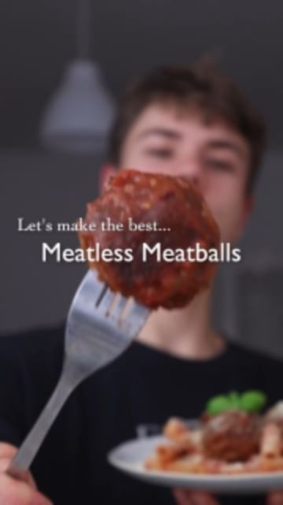

# MEATY MEATLESS MEATBALLS 🤯🌱 you won’t believe they are vegan!by @herbifoods  

> recipe by [@veganfixes](https://www.instagram.com/veganfixes/) 
(Vegan Fixes) - [see original post](https://instagram.com/p/Ccw-PCuJTEI)

••\
This recipe was inspired by the one and only @avantgardevegan - It’s not the quickest vegan meatball recipe out there, but definitely the meatiest and most flavorful I have ever tried! 🤌🏼\
⠀\
RECIPE (6 portions)\
Meatballs:\
- 1/2 onion\
- 250g mushrooms\
- 3-4 garlic cloves\
- 3 tbsp tomato paste\
- 1 tbsp soy sauce\
- 1 cup (240 ml) red wine\
- 1 cup (240 ml) vegetable broth\
- 1 tbsp dried oregano, thyme and rosemary\
- salt and pepper\
- 200g roughly mashed beans or crumbled tofu\
- 3 1/4 cups (415 g) vital wheat gluten\
⠀\
To roast:\
- 1/2 cup (120 ml) red wine\
- 1.5 cups (300g) tomato sauce\
- 1 1/2 cups (360 ml) vegetable stock\
- 1 bay leaf\
- salt & pepper\
- a few thyme sprigs\
- rosemary sprig\
\
To serve:\
- pasta of choice\
- vegan parmesan\
- fresh basil\
⠀\
❶ On high heat sauté mushrooms and onion until most of the liquid has evaporated. Reduce heat, add garlic and sauté for another 1-2 minutes.\
❷ Deglaze the pan with red wine (optional) and vegetable stock, add dried herbs such as thyme, oregano and rosemary, then bring to a simmer. Add mashed chickpeas or kidney beans and simmer for 5 minutes.\
❸ Add the wet mixture to a bowl along with the vital wheat gluten and some fresh parsley. Kneed firmly for at least 10 minutes.\
❹ Shape into balls and set aside.\
❺ Fry the meatballs until slightly browned from all sides.\
❻ Add the balls to a baking pan. Add red wine, tomato sauce, a bay leaf, thyme, rosemary and a pinch of salt and pepper. Cover with tin foil and bake for one hour.\
Try it yourself and tag me @herbifoods ✨ I love seeing your remakes!\
⠀\
TIPS\
- this will make quite a large batch, but these are perfect to keep in the fridge or freezer, so you can get them out whenever you wanna impress your friends or just enjoy some meatless meatballs!\
⠀\
NUTRITION (per portion)\
444 kcal\
59 g protein\
23 g carbohydrates\
7 g fats\
5 g fiber 