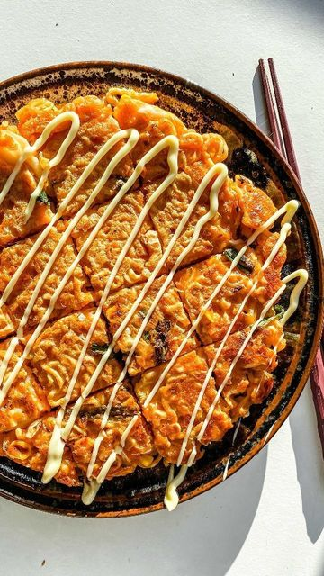

# 🍜🥞I finally tried the shin ramyun and really liked the flavour, but was def too spicy for my sad spice tolerance 🙇🏻‍♀️ sooo thought I try another way to eat it..⁣ by @okonomikitchen 

> recipe by [@veganfixes](https://www.instagram.com/veganfixes/) 
(Vegan Fixes) - [see original post](https://instagram.com/p/CWsM7fSpHwv)

⁣  
ENTER: Savory Instant Ramen Pancakes (Ramen Chijimi). Crispy on the outside, soft and chewy in the middle, loaded with various veggies and a party of flavours!! Kinda like a fusion of kimchi pancakes & Hiroshima style okonomiyaki. ( o˘◡˘o) ⁣  
⁣⁣⁣  
My grandpa used to make us noodle chijimi (Korean style pancakes) with leftover somen or ramen, tried it with a packet of shin ramyun and it is SO 👏🏻 DANG 👏🏻 yummy 🙂. Not too spicy but the flavours come through! A little ~tangy~, cheesy and sweet. ⁣  
⁣  
〰️⁣⁣⁣  
⁣⁣⁣  
INGREDIENTS ⁣  
⁣  
1 packet of instant noodles⁣  
potato starch⁣  
cake flour⁣  
(v) mozzarella cheese ⁣  
nagaimo (can be omitted)⁣  
scallions⁣  
sesame oil⁣  
⁣  
& any add ins you like!! I used cabbage, corn & kimchi— any mushrooms I highly recommend!⁣  
⁣  
⁣⁣  
✨full recipe on okonomikitchen.com [https://okonomikitchen.com/ramen-pancake] link in her story! ⁣⁣⁣⁣⁣  
⁣⁣⁣⁣⁣  
.⁣⁣⁣⁣⁣  
.⁣⁣⁣⁣⁣  
.⁣⁣⁣⁣⁣  
.⁣⁣⁣⁣⁣  
.⁣⁣⁣⁣⁣  
⁣⁣⁣⁣⁣  
  \#shin \#shinramyun  \#instantnoodles \#ramenhack \#kimchipancake \#チヂミ \#cookingasmr \#buzzfeedtasty \#ramen \#foodasmr \#veganfinds \#veganfoodblogger \#veganfoodlover \#veganfortheplanet \#vegansofinsta \#veganessen \#veganfeature \#vegancomfortfood \#veganstrong \#veganislove \#veganized \#veganism \#vegandiet   