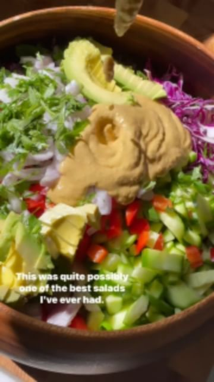

# 🥗 WITH SPICY CASHEW DRESSING by @shredhappens  

> recipe by [@veganfixes](https://www.instagram.com/veganfixes/) 
(Vegan Fixes) - [see original post](https://instagram.com/p/Cc2SJCspUMu)

.\
Perhaps my most favorite salad and dressing combo so far! If you have tried and liked my other ShredHappens salad recipes, I have a feeling you’ll really enjoy this one.\
.\
The spicy cashew dressing is full of flavor - the cashew, ginger, lime, and garlic, combined with the rice vinegar just go so so well together. You have the option of adding some pepper or extra chili flakes for more of a kick and that’s when things really get interesting!\
.\
Here is how I made it:\
.\
1.Lets start with our base. You can use anything you like here, but I personally prefer this combination. Shred up 1/2 small purple cabbage (finely shred is the way to go, this is ShredHappens after all, 😏😂!), add into a bow, then finely dice/chop up 3 Persian cucumbers, 1 red bell pepper, 2 scallions, half a small shallot, handful of fresh cilantro, and 1 small avocado.\
.\
2.Add those all into a bowl, then lets get the spicy cashew dressing going.\
.\
3.In a small food process or blender, add 1/2 cup cashews, 1/4 cup olive oil, 1.5 tablespoons sesame oil, 3 tablespoons rice vinegar, 3 tablespoons soy sauce or tamari, 2.5 tablespoons nutritional yeast, 1 chunk of ginger, 2 cloves of garlic, green chili or pepper of choice (based on your spicy preference), juice of 2 limes, a small handful of cilantro, red chili flakes to taste, and a small pinch of sea salt.\
.\
4.Give the dressing a good blend, give it a taste, then add more of what you like. You’ll probably want to adjust acidity by adding more lime juice, or bring out the flavors by adding more salt, or control the spicy level by adding more cashews if you want it less spicy or more chili flakes if you want it more spicy.\
.\
5.Top your dressing with the dressing, top with white sesame seeds, give it a good toss, then enjoy as is, with some lowcarb chips/crackers, or as a side to your main dish.\
.\
If you give this a try, be sure to tag me or let me know what you think! I love seeing you guys remake my recipes.\
.\
ENJOY.\
.\
.\
.\
.\
.\
.\
\#plantbasedfood \#veganeats \#vegan \#vegandinner \#plantbasedeating \#vegetarianrecipes \#plantbasedrecipes \#plantbasedrecipe \#veganlunch \#whatveganseat \#plantbased \#vegetarian \# 