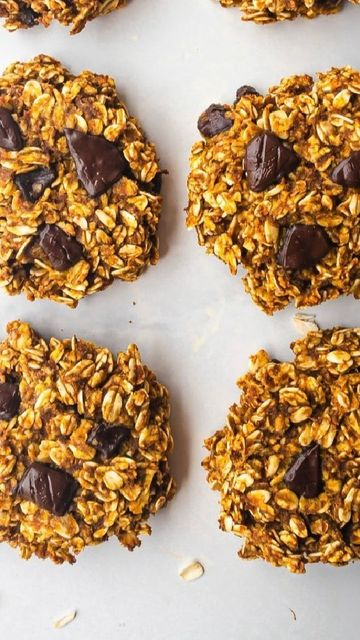

# 🎉🍪🌱 PUMPKIN BREAKFAST COOKIES! By @that.veganbabe 

> recipe by [@veganfixes](https://www.instagram.com/veganfixes/) 
(Vegan Fixes) - [see original post](https://instagram.com/p/CZQsxLBjP6V)

\
🎃These fall inspired cookies are made with only 5 ingredients and are perfect for meal prep!\
\
🔖 Make sure to save this recipe for later!\
\
✨INGREDIENTS✨\
3 cups oats\
1.25 cups pumpkin purée\
1/3 cup maple syrup\
1 tbsp pumpkin pie spice\
\
🥄 Mix until combined then separate into 8-10 cookies & bake for 15 minutes @350F\
\
💜Enjoy & thank you for watching!\
\
.\
.\
.\
.\
.\
.\
.\
.\
.\
.\
.\
.\
\#veganaf \#vegandinner \#veganskincare \#vegana \#veganlunch \#veganrecipe \#veganmeals \#veganlove \#veganathlete \#veganshare \#vegancommunity \#veganeats \#veganbreakfast \#veganuk \#veganismo 