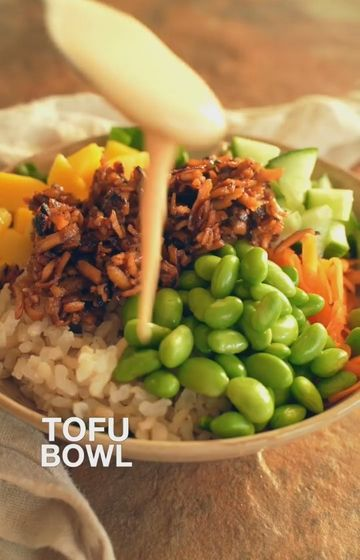

# Shredded Tofu Bowl🤤 Just discovered shredded tofu, it’s a new favorite! by @eatmoreplants.no  

> recipe by [@veganfixes](https://www.instagram.com/veganfixes/) 
(Vegan Fixes) - [see original post](https://instagram.com/p/CW1CV1RqT8h)

\
Ingredients (4 servings)\
Sauce:\
2 tsp sesame oil\
300g extra firm tofu\
4 garlic cloves\
1 tbsp corn starch\
2 tbsp water\
4 stalks spring onion\
0.5 tsp chili flakes\
4 tbsp soy sauce\
4 tbsp maple syrup\
2 tbsp white wine vinegar\
0.5 cup water\
 \
Assemble:\
1 cup dry Rice\
2 handfuls spinach\
1 cup Edamame beans\
0.5 cucumber\
1 Mango\
2 Shredded carrots\
Chili mayo\
 \
Steps:\
1. Start by cooking your rice according to package instructions.\
2. Heat up a frying pan over medium high heat.\
3. Shred the extra firm tofu block into the frying pan.\
4.  In a small bowl, mix cornstarch and 2 tbsp water.\
5. Now add sesame oil, minced garlic, finely chopped scallions, chili flakes, soy sauce, maple syrup, white wine vinegar, and water. Cook until all the liquid is absorbed and the tofu starts to get sticky/crispy. This should take 10-15 minutes, stirring occasionally. \
6. Meanwhile, chop up spinach, cucumber, mango and shred your carrots.\
7. Assemble the tofu bowls and top with chili mayo. I make my own by mixing sriracha and vegan mayo. \
\
\#tofu \#salad \#healthyrecipes \#plantbaseddiet \#veganrecipe 