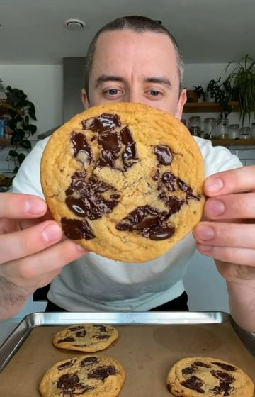

# 4-INGREDIENT COOKIES🍪 by @sovegan Wonderfully chewy in the middle with gooey chocolate chips. And they only require 4 ingredients! Also if you can’t find self-raising flour, you can try using plain (all-purpose) flour with 1 tsp of baking powder - although these will be chewier if you can find self-raising flour!✌️ 

> recipe by [@veganfixes](https://www.instagram.com/veganfixes/) 
(Vegan Fixes) - [see original post](https://instagram.com/p/CVmeS76JXFk)

 
You’ll find the full recipe below👇
 
Makes 6 cookies
 
INGREDIENTS
 
🍪 100g (3.5oz) light brown sugar
🍪 150g (5.3oz) dairy-free margarine
🍪 160g (5.6oz) self raising flour
🍪 80g (2.8oz) 70% dark chocolate
 
INSTRUCTIONS
 
1️⃣ Preheat the oven to 180°C / 350°F fan-assisted and line 2 large baking trays with baking paper
 
2️⃣ Cream the sugar and margarine together in a mixing bowl. Then stir in the self-raising flour until combined.
 
3️⃣ Roughly chop the dark chocolate into small chunks and stir it into the cookie dough (save a dozen or so pieces to push into the cookies). The dough might become really soft if your kitchen is quite warm so try refrigerating the dough for 10 minutes or so if you need to.
 
4️⃣ Divide the dough into six pieces, then roll each piece into a ball and place them on the baking trays with a good distance between them. Push the remaining chocolate chunks into the top of the balls, then bake in the oven for 12-15 minutes or until the cookies begin to turn golden brown around the edges.
 
5️⃣ Leave the cookies for 15 minutes or so to harden slightly, then transfer to a cooling rack. We love to eat these while they’re still warm but they’ll keep well for 3 days in an air-tight container. 