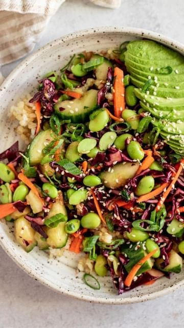

# Mashed cucumber salads by @plantbasedrd 

> recipe by [@veganfixes](https://www.instagram.com/veganfixes/) 
(Vegan Fixes) - [see original post](https://instagram.com/p/Cc_LuGkhFN4)

Fiber-filled, filling and everything I need to help pick me up in the afternoon. Full details and storage tips are on the blog linked in bio.

Salad Prep
1 English or Japanese cucumber
Pinch Salt & Sugar
2 cups shredded red cabbage
1 cup shredded carrots
2 cups frozen edamame, thawed
1/4 cup or more cilantro or parsley, roughly chopped

Sauce Prep
2 tbsp soy sauce or gluten-free soy sauce
1-2 tsp toasted sesame oil
1-2 tsp chili garlic sauce
1 tbsp lime juice (about one lime) or rice wine vinegar
1-2 tsp sugar or maple syrup (adjust to taste)
2 stalks of green onions, sliced
1-2 cloves garlic, grated or crushed with a garlic press
2 tsp sesame seeds
1-2 tsp chili crisp oil, optional (but does give more flavor and heat - I used @flybyjing)

For Serving
Cooked rice or quinoa
Avocado

Place your cucumber on a flat cutting board and with a rolling pin or the flat side of your knife, smack down on the cucumber to split it. Now, cut them into 1-inch pieces.

Optional, but it does help keep your cucumbers nice and crispy. Place the cucumber in a strainer sitting on top of a bowl along with a pinch of salt and sugar. Allow the cucumbers to sit and draw out excess liquid for at least 15 minutes as you prepare the remaining vegetables (tip from @tiffy.cooks). 

To a small bowl or jar, prep your sauce by combining all the sauce ingredients and whisking together. Make sure to taste and adjust the flavor of the sauce to your liking.

In a mixing bowl add the cabbage, carrots, edamame and herbs.

Drain your cucumbers and pat dry with a paper towel or clean kitchen towel.

When ready to serve add the cucumber and pour over your sauce. Give everything a good toss to coat and serve as desired.

.
.
.
.
.
.
.
.
.
\#plantbasedfood \#veganeats \#vegan \#vegandinner \#plantbasedeating \#vegetarianrecipes \#plantbasedrecipes \#plantbasedrecipe \#veganlunch \#whatveganseat \#plantbased \#vegetarian \#vegans \#plantbaseddiet \#vegansofig 