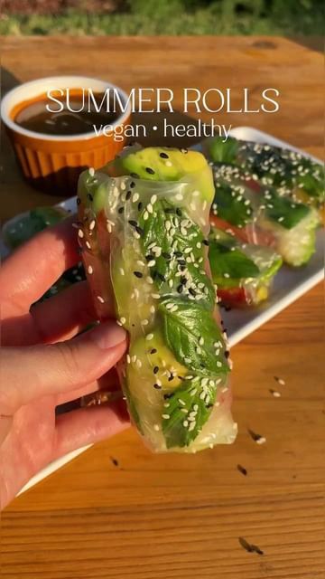

# SUMMER ROLLS🌈 // full recipe ↓by @itsvegansis 

> recipe by [@veganfixes](https://www.instagram.com/veganfixes/) 
(Vegan Fixes) - [see original post](https://instagram.com/p/Cgogx-2pLUZ)

\
Packed with veggies and dipped in the most delicious & creamy peanut sauce, these summer rolls make the perfect meal / snack!\
So get ready cause this recipe is a must try!🤩\
\
INGREDIENTS: (for 8-10 rolls)\
- Rice paper\
- Your favorite vegetables (I used 1 large mango, 1 carrot, 1 cucumber, 1 red pepper, 1 avocado, and mint leaves)\
\
for the peanut sauce\
- 3 tbsp peanut butter\
- 2 tsp maple syrup\
- 2 tsp lemon juice\
- 2 tsp soy sauce\
- 1-2 tbsp water\
\
INSTRUCTIONS:\
Cut all the vegetables into thin slices and set aside. Dip one sheet of rice paper in cold water, then immediately place on a cutting board or a plate. \
Place the vegetables in the middle of the rice paper sheet, and roll as shown in the video. Sprinkle some sesame seeds on top of them. \
Make the sauce by mixing all the ingredients until smooth and shiny. ENJOY!\
.\
.\
.\
.\
.\
.\
.\
.\
.\
.\
.\
.\
.\
.\
\#plantbasedfood \#veganeats \#vegan \#vegandinner \#plantbasedeating \#vegetarianrecipes \#plantbasedrecipes \#plantbasedrecipe \#veganlunch \#whatveganseat \#plantbased \#vegetarian \#vegans \#plantbaseddiet \#vegansofig 