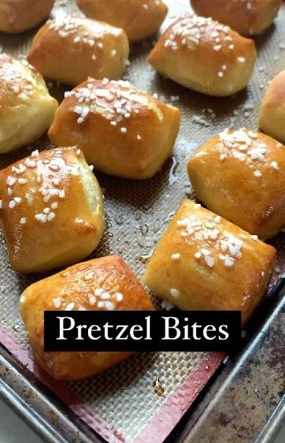

# Pretzel Bites 🥨 by @that.veganbabe 

> recipe by [@veganrecipesideas](https://www.instagram.com/veganrecipesideas/) 
(Vegan Recipes) - [see original post](https://instagram.com/p/CXET7CqgFgC)

  
Follow us @veganrecipesideas for more vegan recipes 💚🌱  
  
✨Ingredients✨   
  
For the dough:  
2+1/4 cup flour  
1/2 tsp salt  
1 tsp sugar  
1 tbsp instant yeast*** must be instant*** see sub for active dry yeast at end of recipe  
1 cup warm water  
  
Baking soda bath:  
5 cups water  
1/4 cup baking soda  
  
Kosher or flakey salt  
4 tbsp vegan butter or coconut oil for brushing   
  
Method 🥄   
  
1️⃣ Start my making the dough. Add the flour, salt, sugar & active yeast to a bowl and mix. Add 1 cup of warm water and mix until the dough becomes shaggy.   
  
2️⃣Put the dough on the counter and knead for 5 minutes until the dough comes together and is a smooth texture. Roll into a ball and place in a greased bowl, cover & proof until it has doubled in size 30-60 min  
  
3️⃣Take the dough out and cut into 4-5 pieces. Roll into long strips then cut into even sized pieces.  
  
4️⃣Male the baking soda bath by adding the water & baking soda to a pot and bringing to a gentle simmer. Add in the dough bites and leave for 30 seconds. Scoop out with a slotted spoon, drain excess liquid & put onto a baking tray.  
  
5️⃣Put a generous amount of flaky or kosher salt on the bites, and bake for 10-13 minutes at 450 degrees until golden brown  
  
6️⃣Brush with meted vegan butter or coconut oil and serve  
  
These are soooooooo amazing I hope you guys love them!!! 🤗😍  
  
*** Sub for active dry yeast***  
  
If using active dry yeast instead, mix 1 tbsp yeast with 1/4 cup warm water and a pinch of sugar & let sit for 10 min then add with the rest of the ingredients and decrease the amount of water added by a 1/4 cup  
  
\#pretzels \#pretzelbites \#pretzel \#pretzelrecipe \#vegan \#veganrecipes \#plantbased \#superbowl \#superbowlsnacks \#vegansnacks \#veganfood \#veganfoodshare \#veganfoodie \#veganfoodporn \#vegansofig \#plantbasedfood   