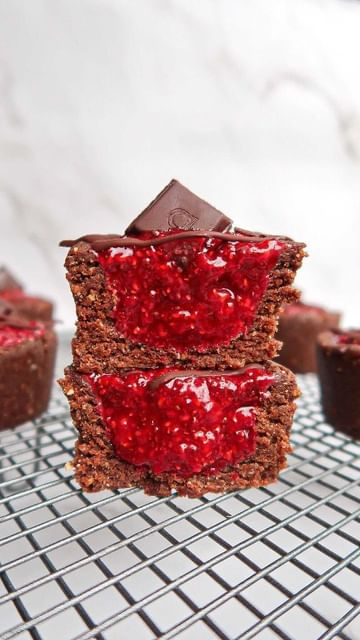

# No-Bake Choc Raspberry Tarts 🍫 by @chloeevegan 

> recipe by [@veganrecipesideas](https://www.instagram.com/veganrecipesideas/) 
(Vegan Recipes) - [see original post](https://instagram.com/p/CdKEDJdAdCY)

.
.
🤍 Vegan, refined sugar-free, gluten-free and oil-free. 

Recipe:
Raspberry Chia Jam:
- 2 Cups Frozen Raspberries
- 2 Tbsp Chia Seeds
- 2 Tbsp Rice Malt Syrup
- 2 Tbsp Hot Water

Choc Tart Shell:
- 1 & 1/2 Cups Roasted Almonds
- 1 & 1/2 Cups Oats
- 7 Large Medjool Dates (Soaked in hot water for 5 minutes and drained) 
- 3 Tbsp Cacao Powder
- 3-4 Tbsp Oat Milk 
- 1 Tsp Vanilla
- Pinch of Salt

Garnish:
- 5-10g Melted Vegan Dark Choc
- 6 Vegan Dark Choc Squares 

1. Place all jam ingredients into a bowl and mash until smooth. Be patient with it, the raspberries with eventually melt and become jam-like. 
2. Place all tart shell ingredients into a food processor and process until smooth. Push into to a 6-hole silicon tray and use your hands to create a well in each. 
3. Fill with the raspberry jam and set in the freezer for 30 minutes. Garnish with chocolate and set in the freezer for 5 minutes. Enjoy!
4. Store in the refrigerator for up to 5 days. 

\#vegan \#veganfood \#veganshares \#veganrecipes \#veganeats \#vegansnacks \#vegandesserts \#veganfoodshare \#vegans \#healthy \#healthyfood \#healthyrecipes \#easyrecipes \#easyfood \#vegantart \#nobake \#nobakerecipes \#nobakedesserts \#veganchocolate \#raspberrychiajam 