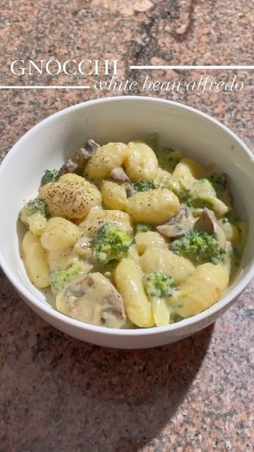

# Gnocchi in a creamy white bean alfredo sauce with broccoli and mushrooms 🤤 by @pinchofparsley_ 

> recipe by [@veganrecipesideas](https://www.instagram.com/veganrecipesideas/) 
(Vegan Recipes) - [see original post](https://instagram.com/p/CcArAvVJZtR)

ingredients:
- 1 tablespoon oil 
- 16oz gnocchi
- 1 broccoli crown, chopped 
- 12oz baby bella mushrooms 
white bean alfredo sauce:
- 1 shallot
- 3 garlic cloves
- 1 (15oz) can of cannellini beans
- 1/2 cup non-dairy unsweetened unflavored milk (i used soy)
- juice from 1/2 lemon 
- 1 1/2 tablespoons olive oil
- 1/4 cup nutritional yeast
- 1 & 1/2 tsps salt
- 1/2 tsp pepper

instructions:
1. heat a straight sided skillet over medium heat, add olive oil, shallot, and garlic. sauté for 3 minutes until fragrant and softened. scoop out the garlic and shallot and set aside (will be used for the sauce)
2. to the same skillet add in the mushrooms and sauté for 8-10 minutes until golden and browned
3. in a large pot, bring salted water to a boil and add broccoli letting cook for 2 minutes then add in the gnocchi and cook according to package instructions. strain once cooked.
4. while the mushrooms and gnocchi/broccoli combo are cooking to a blender add white beans, sautéed garlic and shallot, non-dairy milk, nutritional yeast, salt, pepper, olive oil, and lemon juice. blend for 1-2 minutes until creamy smooth. 
5. going back to the skillet with the mushrooms, add in the sauce, gnocchi and broccoli and mixed until combined. top with freshly cracked pepper and maybe some vegan parmesan ENJOY!
•
•
•
\#eeeeeats \#comfortfood \#gnocchi \#creamsauce \#pastarecipe \#pastalover \#foodreels \#carbsoncarbs \#veganpasta \#plantbased \#plantbasedfoods \#vegancomfortfood \#noodles \#pastarecipe \#alfredopasta \#alfredosauce \#whitebeans \#pastasauce \#f52grams \#veganfoodblog \#creamypasta \#mushrooms \#broccolirecipes \#plantbasedpasta \#weeknightdinner \#fridaynightdinner 