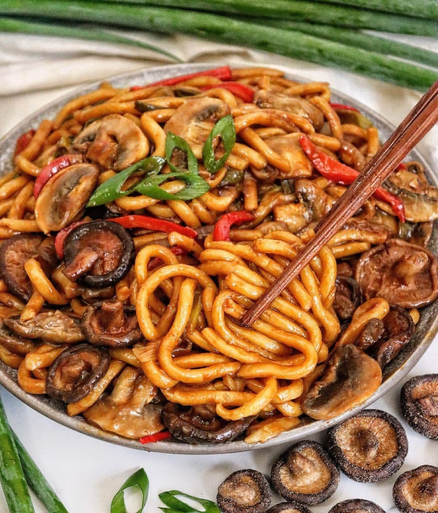

# TERIYAKI MUSHROOM UDON NOODLE STIR-FRY 🍜 😍 by @run2food Save this saucy & delicious noodle dish onto your to-do list! Seriously one of the yummiest dishes ever 😋⁣ 

> recipe by [@veganrecipesideas](https://www.instagram.com/veganrecipesideas/) 
(Vegan Recipes) - [see original post](https://instagram.com/p/CVAvrtjpcuM)

\
Follow us @veganrecipesideas for more vegan recipes 💚🌱\
⁣.\
.\
Udon noodles are one of my faves to use in a stir-fry because they are thick & maintain their texture well ✨ This recipe is so delicious and would be a fav meal prep dish too 🙌🏼⁣\
⁣\
Here is the recipe ➡️⁣\
⁣\
TERIYAKI MUSHROOM UDON NOODLE STIR-FRY⁣\
⁣\
Serves: 2 ⁣\
⁣\
INGREDIENTS:⁣\
✅100g udon noodles⁣\
✅ 1 onion, sliced ⁣\
✅ 3 stalks spring onion, sliced ⁣\
✅ 1 red capsicum, sliced ⁣\
✅ 300g mushrooms, sliced (I used combo of white button & shiitake) ⁣\
✅ 1 tablespoon oil ⁣\
⁣\
Teriyaki Sauce:⁣\
✅1/4 cup soy sauce (or tamari)⁣\
✅2 teaspoons dark soy sauce ⁣\
✅1/4 cup water ⁣\
✅2 tablespoons maple syrup ⁣\
✅1/2 tablespoon rice wine vinegar (or white vinegar)⁣\
✅ 1 teaspoon minced garlic⁣\
✅ 1 teaspoon minced ginger⁣\
✅ Cornstarch slurry: 1 tablespoon cornstarch + 1 tablespoons water ⁣\
⁣\
METHOD:⁣\
1. Make the TERIYAKI SAUCE: In a small saucepan on medium-high heat, combine the water, soy sauces, maple syrup, garlic & ginger. Bring to a boil, then add the cornstarch slurry & reduce heat down to a simmer. Cook, whisking as needed, until the teriyaki sauce is glossy & slightly thickened. Adjust seasoning to taste with soy sauce/water. Set aside⁣\
⁣\
METHOD:⁣\
1. Cook the udon according to packet instructions. Drain & set aside.⁣\
2. Heat up the oil in a wok on high heat, stirfry the onions & capsicum for 3 mins until slightly tender. Add in the mushrooms + half the Teriyaki sauce & cook for a further 3 mins⁣\
3. Add in your noodles and the rest of the Teriyaki sauce, toss until all the noodles are coated in sauce.⁣\
4. Stir-fry for a further 5-6 mis, adding a dash of water if you need⁣\
⁣\
**Storage tips:  in an airtight container in the fridge for up to 3 days or in the freezer for months ⁣\
⁣\
Slurp away guys! 🤤 Definitely let me know if you try this! 