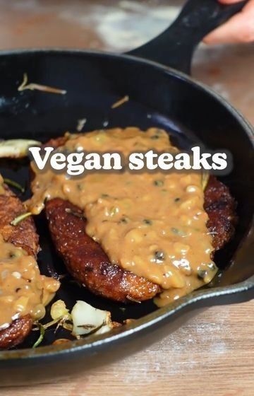

# VEGAN STEAK 🌱 by @fitgreenmind Yes, it’s vegan! 😜 

> recipe by [@veganrecipesideas](https://www.instagram.com/veganrecipesideas/) 
(Vegan Recipes) - [see original post](https://instagram.com/p/CWvz04SBaG4)

Follow us @veganrecipesideas for more vegan recipes 💚🌱
.
.
And now, I you’re looking for a really good vegan recipe for holiday season…this is the one you should try! 😌

RECIPE (5 big steaks each 268cal/27P/17C/8F):
Steak:
-1 cup (190g) beans (I used chickpeas)
-2 Tbsp tomato paste
-2 Tbsp soy sauce
-2 Tsp smoked paprika
-1 Tsp thyme, rosemary, garlic powder and salt
-1/4cup (60ml) vegan red wine (or more water)
-1/4 cup (60ml) water
-1 cup (130g) vital wheat gluten
-2/3 cup (75g) chickpea flour
BLEND/KNEAD 2 minutes/SHAPE into 5 steaks
Broth:
-4 cups (1 L) veg stock
-1 cup (250ml) vegan red wine (or more veg stock)
-1 onion
-3 cloves garlic
-a handful Rosemary
COOK the steaks for 15mins/FRY them afterwards
GRAVY:
-1 onion
-2 cloves garlic
-1 Tbsp peppercorns
-2 Tbsp flour
-1 cup (250ml) plant milk
-1/4 cup (60ml) of the steak broth
-1 Tbsp soy sauce
COOK until creamy
-
-
-
VEGANES STEAK 🌱 Ja, das ist vegan! 😜

REZEPT (5 große Steaks je 268kcal/27P/17K/8F):
Steak:
-190g Bohnen (bei mir waren es Kichererbsen)
-2 El Tomatenmark 
-2 El Sojasauce
-2 Tl Räucherpaprika 
-je 1 Tl Thymian, Rosmarin, Salz und Knoblauchpulver 
-60ml Rotwein (oder mehr Wasser)
-60ml Wasser
-130g Seitan Fix
-75g Kichererbsenmehl 
MIXEN/KNETEN 2min/5 Steaks FORMEN
Brühe:
-1L Gemüsebrühe
-250ml Rotwein oder mehr Brühe
-1 Zwiebel
-3 Zehen Knoblauch 
-eine Handvoll Rosmarin 
KOCHE die Steaks für 15min/BRATE sie danach gut an
SAUCE
-1 Zwiebel
-2 Zehen Knoblauch 
-1 El Pfefferkörner 
-2 El Mehl 
-250ml Pflanzenmilch 
-60ml der Steakbrühe
-1 El Sojasauce
KOCHE die cremig. 