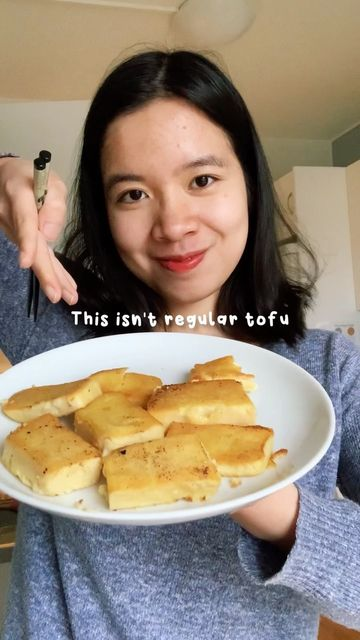

# Chickpea Tofu (2-ingredient recipe) 

> recipe by [@veggieanh](https://www.instagram.com/veggieanh/) 
(Anh - Vegan Recipes 🌱) - [see original post](https://instagram.com/p/CY__LnYJmzU)

  
To all my soy intolerant friends 🥰 This is a soy-free alternative to tofu and can be used in any dishes like curries, salad or stir fry. Note that it can be more fragile and less sturdy than firm soy tofu.  
  
Another method to make chickpea tofu is to cook chickpea flour with water until thicken 😊  
  
Recipe:  
200g dry chickpeas, soak overnight (sub with 150g chickpea flour)  
500ml water  
  
Full recipe in LINK IN BIO or go to:   
  
https://veggieanh.com/burmese-tofu-from-chickpeas/  
  
\#burmesetofu \#chickpeatofu \#chickpea \#soyfree \#tofu \#vegan \#veganuary \#vegetarianrecipes \#veganskt   