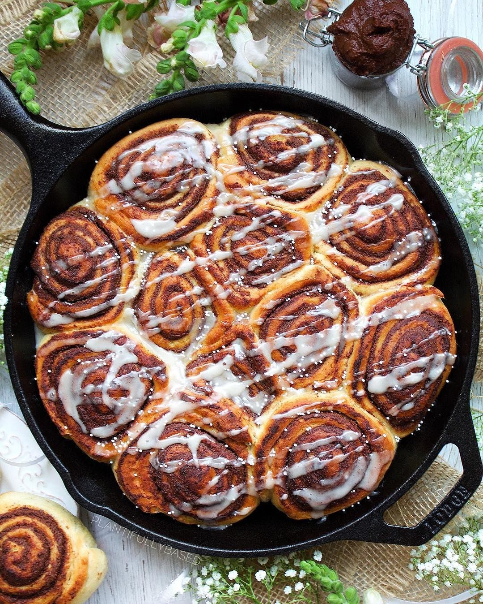

# Cinnamon rolls filled with plant-based Nutella anyone? This one-pot dessert is sure to go down a treat during the festive season 😍🎄⠀ 

> recipe by [@wearefuturebites](https://www.instagram.com/wearefuturebites/) 
(Future Bites) - [see original post](https://instagram.com/p/BrU6ROyj7zz)

⠀  
Tap the link in our bio for the recipe from @plantifullybased 👆🏼⠀  
⠀  
.⠀  
.⠀  
.⠀  
.⠀  
.⠀  
.⠀  
.⠀  
.⠀  
.⠀  
\#delicious \#veganlifestyle \#eatclean \#cleaneating \#veganfoodlovers \#veggies \#veganismo \#plantpower \#yummy \#dairyfree \#bestofvegan \#vegetariano \#veganpower \#veganfit \#foodstagram \#plantpowered \#veggie \#veganlove \#vegandinner \#veganfoodie \#foodphotography \#nutrition \#veganaf \#instagood \#fitness⠀  
http://bit.ly/2B30bDf   