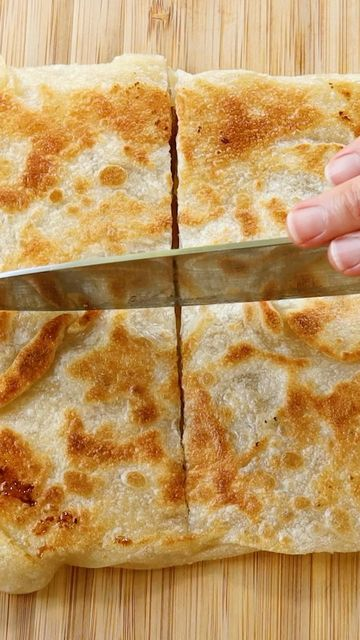

# Roti Pisang (Banana) with sweet caramelized banana on the inside with a crispy crunch on the outside is one of the sweet versions of roti canai. We get this often at Mamak stalls - my teenager hangs out place. It's like Starbucks here but with no air-conditioning.😄 Most roti canai is vegetarian but not vegan friendly. This roti pisang is! If you like banana, I hope you give this delicious roti a try too. Don't forget a cup of teh tarik (pulled tea) to go with it😋⁣ 

> recipe by [@woon.heng](https://www.instagram.com/woon.heng/) 
(WoonHeng Chia) - [see original post](https://instagram.com/p/CVGXCx2pbVN)

⁣
Full recipe instructions and long video: https://woonheng.com/vegan-roti-pisang-banana/⁣
or link in bio☝🏼⁣
⁣
Cooking notes:⁣
- As usual, I tried to include as many steps as possible into a short video, please check my long video for the complete process⁣⁣⁣
- I used all-purpose flour in this recipe⁣
- If you plan to make the dough ahead of time and refrigerate, please thaw to room temperature before working on the dough⁣
⁣
Have a beautiful weekend. Best, WoonHeng 韵馨💗⁣⁣⁣⁣
.⁣
.⁣
.⁣
.⁣
.⁣
\#rotipisang \#roticanai \#bananaroti \#malaysianfood \#indianfood \#bananabread \#streetfood \#recipeoftheday \#compassionateliving \#plantbased \#buzzfeedfood \#yahoofood \#woonheng \#veganrecipes \#f52grams \#foodandwine 