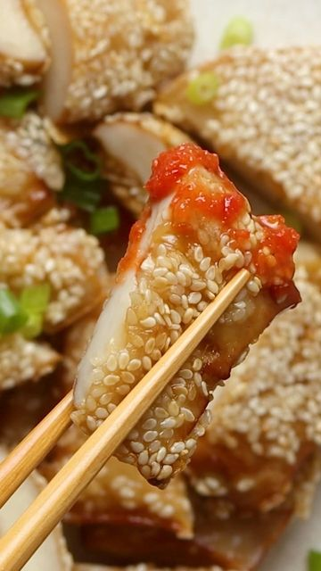

# Vegan Sesame 'Chicken'😋made from king oyster mushrooms. This recipe is easy and fun to make. Using a meat tenderizer creates an amazing texture that absorbs the marinade so well with a great chew in each bite, similar to the rendang mushrooms (made from dried mushrooms stem) I got back at home. 👍🏼 

> recipe by [@woon.heng](https://www.instagram.com/woon.heng/) 
(WoonHeng Chia) - [see original post](https://instagram.com/p/CVYDxvRFbGq)

⁣  
Full recipe: https://woonheng.com/vegan-sesame-chicken/⁣  
or search 'sesame chicken' at woonheng.com⁣  
⁣  
Cooking notes:⁣  
- This recipe is very similar to my sesame tofu but uses a different batter. A simple mix of Kikkoman batter with ice-cold water to create a thick batter⁣  
- For homemade batter recipe, check my Korean 'fried' tofu.⁣  
- Please use white sesame seeds or raw so they don't burn easily⁣  
- Serve with rice or dip in sauce or check out my ginger chili sauce (10-minute recipe using red jalapeño)⁣  
⁣  
I hope you give this a try and have a beautiful weekend. Best, WoonHeng 韵馨💗⁣⁣⁣  
.⁣⁣⁣  
.⁣⁣⁣  
.⁣⁣⁣  
.⁣⁣⁣  
.⁣⁣⁣  
\#veganmeat \#plantbased \#forkyeah \#buzzfeedfood \#sesamechicken \#veganrecipes \#igfoodies \#asiancooking \#f52grams \#asianfood \#woonheng \#tasty \#foodgawker \#eatrealfood \#foodandwine \#compassionateliving \#tastemademedoit   