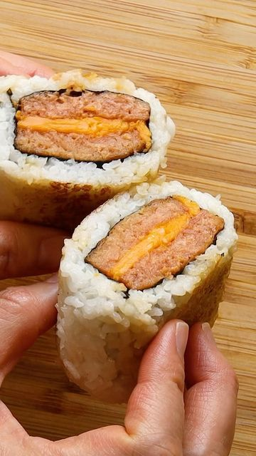

# This Vegan Luncheon Roll🤩 is absolutely TASTY😋 and super easy to make #omnilicious. I haven't had luncheon meat in ages and this OmniPork Luncheon by @omnifoods.global definitely hits all the spot--the texture and taste are all on point! It’s also rich in protein and has far fewer calories than the traditional ones. OmniPork Luncheon can be found at all Sprouts locations nationwide. So, don’t wait and stock it up (I got 4 packs already😄) to make the recipe below! [AD]⁣ 

> recipe by [@woon.heng](https://www.instagram.com/woon.heng/) 
(WoonHeng Chia) - [see original post](https://instagram.com/p/CVk1sAcFtJa)

⁣  
Makes 3 rice rolls⁣  
3 cups of cooked rice, preferably short-grain⁣  
1 pack of OmniPork Luncheon ⁣  
3 slices of vegan cheese, fold in half⁣  
3 half-sheet nori⁣  
oil for cooking⁣  
sushi vinegar/rice vinegar ⁣  
Sauce: 1 tablespoon soy sauce, 1 tablespoon mirin⁣  
⁣  
First, whisk together soy sauce and mirin in a bowl until well-combined, then set aside.⁣  
Next, heat a large non-stick skillet over medium heat. Place OmniPork luncheon on the hot pan and pan-fry until golden brown on both sides. Top 3 of them with vegan cheese, then stack with another luncheon to make 3 sets. ⁣  
Now, spread about 1 cup of rice on a lined sushi mat to make a 5X6 rectangle. Lay a half-sheet nori to cover ⅔ of the rice. Place a stack of luncheon on the nori sheet that has no rice under it. Now, roll it up and use the mat to help fold the rice. Rub your palms with sushi vinegar and mold while compressing the roll into an enclosed log. Clean the skillet from above, and lightly grease the pan. Place as many rice rolls as the pan comfortably fits. Grill over med-low heat until a thin crust forms, about 2-3 minutes. Flip and brush the crusted side with the prepared sauce. Repeat the same step a few times and cook until golden brown (adjust the heat if it browns too quickly). Serve the rice roll immediately.⁣  
.⁣⁣⁣⁣  
.⁣⁣⁣⁣  
.⁣⁣⁣⁣  
.⁣⁣⁣⁣  
.⁣⁣⁣⁣  
\#Omnifoods \#omnipork \#OmniLuncheon \#luncheon \#cookomni \#plantpowertoall \#riceroll \#onigiri \#fallrecipes \#foodandwine \#vegandinner \#asianfood \#tastemadedoit \#compassionateliving \#buzzfeedfood \#woonheng   